# CPE 322 Lab 10

## Chris Bertuzzi

---

### Steps

1. Run hash_value.py twice and compare results

`python3 hash_value.py`
`python3 hash_value.py`

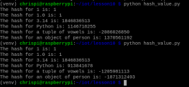

The hash results show consistent values for immutable objects like integers, floats, and tuples across both runs, as expected, because their hash values are determined by their content. However, the hash values for the "object of person", a mutable custom class instance, changed between runs. This is typical because such objects' hash values can vary with each program execution, often influenced by their memory addresses which are not fixed across sessions.

2. Run snakecoin.py

`python3 snakecoin.py`

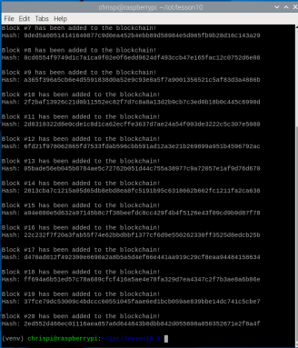

3. Run snakecoin-server-full-code.py on Terminal 1 and mine a new block on Terminal 2

**Terminal 1:**

`python3 snakecoin-server-full-code.py`

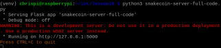

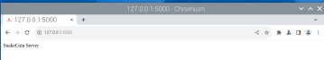

**Terminal 2:**

`curl "localhost:5000/txion" -H "Content-Type: application/json" -d '{"from": "akjflw", "to":"fjlakdj", "amount": 3}'`

`curl localhost:5000/mine`

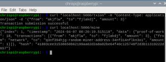

Terminal 1 Output:

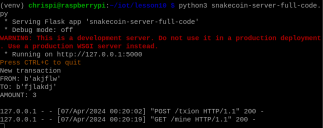

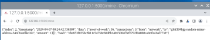

4. Clone Python blockchain app and uncomment the last line of node_server.py

`git clone https://github.com/satwikkansal/python_blockchain_app.git`

Uncomment last line in node_server.py

5. Run node_server.py on Terminal 1 and run_app.py on Terminal 2

**Terminal 1:**

`python3 node_server.py`

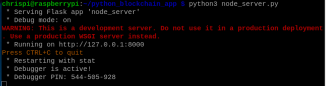

**Terminal 2:**

`python3 run_app.py`

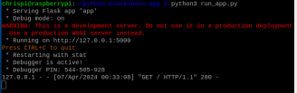

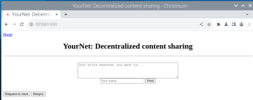

---

### Blockchain App in action

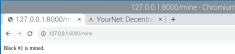

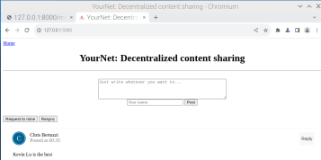
