# CPE 322 Lab 2

## Chris Bertuzzi

### Command

`hostname`

### Explanation

Prints or sets the hostname of the current system.

### Output

```txt
rasberrypi
```

---

### Command

`env`

### Explanation

Prints out Environment Variables for the current system.

### Output

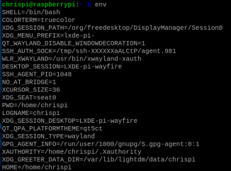

---

### Command

`ps`

### Explanation

Reports process status.

### Output

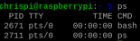

---

### Command

`pwd`

### Explanation

Print the name of the current working directory.

### Output

```txt
/home/chrispi
```

---

### Command

`git clone https://github.com/kevinwlu/iot.git`

### Explanation

Clones the iot repository into a newly created directory.

### Output

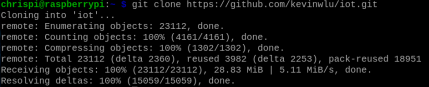

---

### Command

`cd iot && ls`

### Explanation

Change the current directory to iot, then lists information about the files inside.

### Output

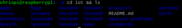

---

### Command

`cd`

### Explanation

Change the current directory back to the home directory (~ i.e. /home/chrispi)

### Output


---

### Command

`df`

### Explanation

Show information about the file system on which each FILE resides, or all file systems by default.

### Output

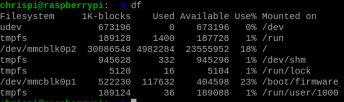

---

### Command

`mkdir demo && cd demo`

### Explanation

Creates the directory demo then changes the current directory to the newly created one.

### Output

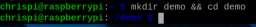

---

### Command

`nano file`

### Explanation

Opens a text editor within the command line to edit the file 'file'.

### Output

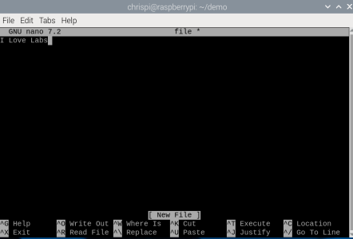

---

### Command

`cat file`

### Explanation

Prints the contents of the file 'file'.

### Output


---

### Command

`cp file file1`

### Explanation

Copies file into an additional file 'file1'.

---

### Command

`mv file file2`

### Explanation

Renames file, now calling it 'file2'.

---

### Command

`rm file2`

### Explanation

Removes the file 'file2'.


### Output

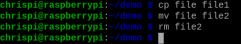

---

### Command

`clear`

### Explanation

Clears the terminal's text

### Output

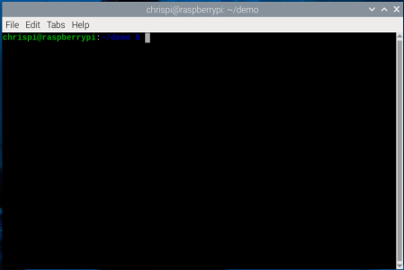

---

### Command

`man uname`

### Explanation

Opens up an manual within the terminal with information about the command 'uname'.

---

### Output

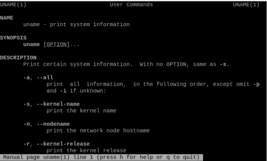

---

### Command

`uname -a`

### Explanation

Print certain system information.

### Output

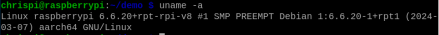

---

### Command

`ifconfig`

### Explanation

Prints information about the computer's current IP configuration.

### Output

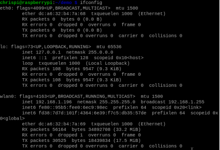

### Command

`ping localhost`

### Explanation

Verifies IP-level connectivity to the local computer

### Output

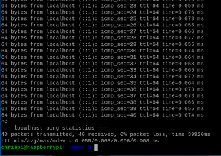

---

### Command

`netstat`

### Explanation

Displays protocol statistics and current TCP/IP network connections.

### Output

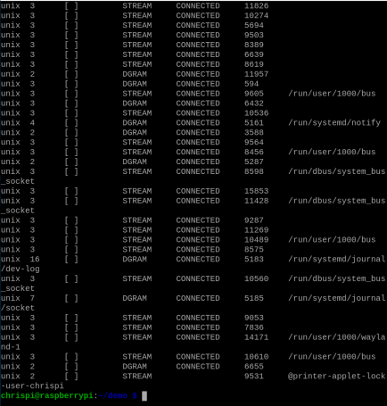

---
