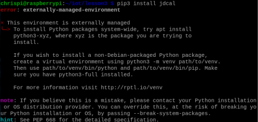
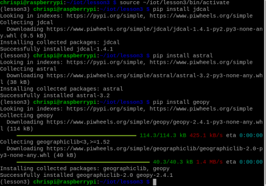
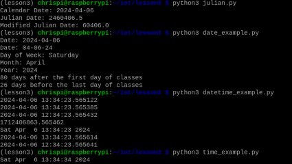
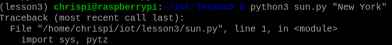
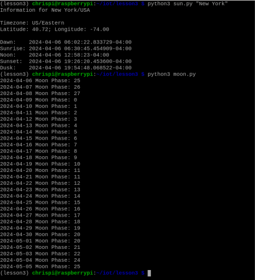
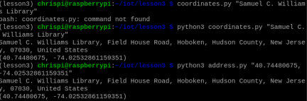
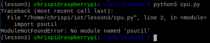
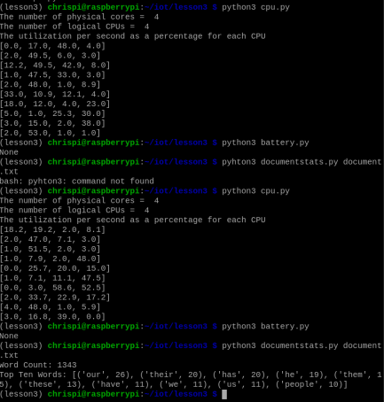

# CPE 322 Lab 3

## Chris Bertuzzi

---

### Steps

1. Install pip

`sudo apt install python3-pip`

2. Install python packages

`pip3 install jdcal`
`pip3 install astral`
`pip3 install geopy`

### ERROR

### Solution

1. Create a virtual environment for my project

`python3 -m venv ~iot/lesson3`

2. Activate virtual environment

`source ~iot/lesson3/bin/activate`

3. Install Python packages

`pip3 install jdcal`
`pip3 install astral`
`pip3 install geopy`

### SUCCESS!!

---

### Time to start the Lab

### Error

### Solution

1. Install Pytz

`pip install pytz`

---

### Back to the Lab

### ERROR

### Solution

1. Install psutil

`pip install psutil`

### Back to the Lab

---
