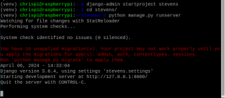
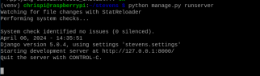
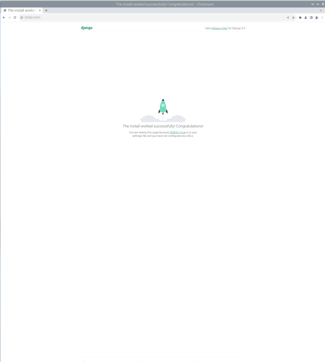
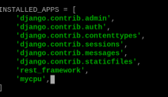
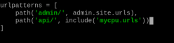
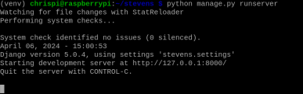
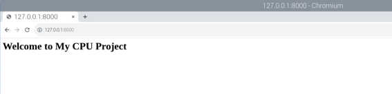
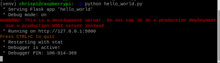
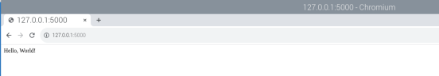

# CPE 322 Lab 4

## Chris Bertuzzi

---

### Steps

1. Install Django and Django REST framework

`pip install django djangorestframework`

2. Start Django Project "Stevens," Run Server, and View App

`django-admin startproject stevens`
`cd stevens`
`python manage.py runserver`

### WARNING



### Solution

`python manage.py migrate`

### Server running withj no issues





---

### Start Django REST Project "Mycpu", Run Server, and View App

1. Create 'mycpu' app

`python manage.py startapp mycpu`

2. Add 'mycpu' and 'rest_framework" to INSTALLED_APPS



3. Define a Simple Model in 'mycpu'

in mycpu/models.py

```
class Item(models.Model):
    name = models.CharField(max_length=100)
    description = models.TextField()

    def __str__(self):
        return self.name
```

4. Run Migrations

`python manage.py makemigrations mycpu`
`python manage.py migrate`

5. Create a Serializer for Model

in mycpu/serializers.py

```
from rest_framework import serializers
from .models import Item

class ItemSerializer(serializers.ModelSerializer):
    class Meta:
        model = Item
        fields = '__all__'
```
6. Create a View

in mycpu/views.py

```
from rest_framework import generics
from .models import Item
from .serializers import ItemSerializer

class ItemList(generics.ListAPIView):
    queryset = Item.objects.all()
    serializer_class = ItemSerializer
```

7. Setup URL Routing

in mycpu/urls.py

```
from django.urls import path
from .views import ItemList

urlpatterns = [
    path('items/', ItemList.as_view(), name='item-list'),
]
```

in stevens/urls.py




8. RUN THE SERVER !!!





---

### Install Flask, Run Flask server via hello_world.py and view app

1. Install Flask

`pip install Flask`

2. Create Flask Application

in hello_world.py

```
from flask import Flask
app = Flask(__name__)

@app.route('/')
def hello_world():
    return 'Hello, World!'

if __name__ == '__main__':
    app.run(debug=True)
```

3. RUN APP !!!





---
