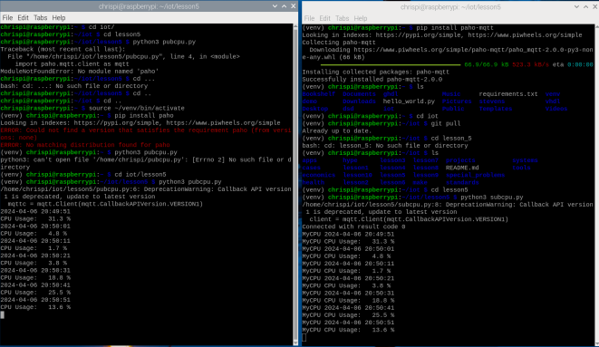

# CPE 322 Lab 5

## Chris Bertuzzi

---

### Steps

1. Install Paho-MQTT

`pip install paho-mqtt`

2. Run subcpu.py and pubcpu.py on two separate terminals

`python3 subcpu.py`
`python3 subcpu.py`

