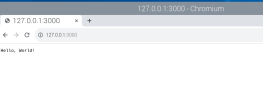
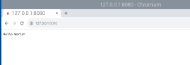
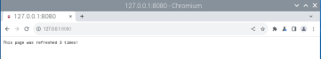
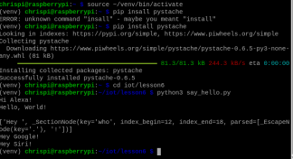

# CPE 322 Lab 6

## Chris Bertuzzi

---

### Steps Part 1

1. Install Node.js

`sudo apt install -y nodejs npm`

2. Run hello-world.js, hello.js, and http.js

`node hello-world.js`
`node hello.js`
`node https.js`

3. Visit Servers

Hello-world

Hello

Http

---

### Steps Part 2

1. Install Pystache

`pip install pystache`

2. Run say_hello.py

`python3 say_hello.py`

### Output

