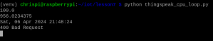
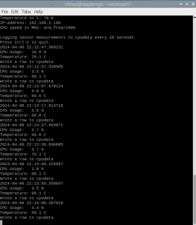
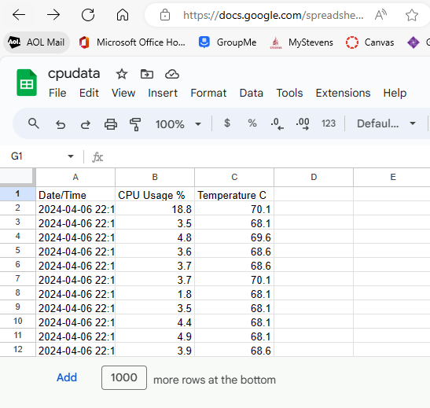

# CPE 322 Lab 7

## Chris Bertuzzi

---

### ThingSpeak and Script Exceution

1. Run thingspeak_cpu_loop.py

`python thingspeak_cpu_loop.py`

---

### Google Sheets and Script Exceution

1. Install Libraries

`pip install gspread oauth2client`

2. Create Google Sheet and JSON Download Key

3. Edit rpi_spreadsheet.py

GDOCS_OAUTH_JSON = 'key.json'

GDOCS_SPREADSHEET_NAME = 'cpudata'

4. Run rpi_spreadsheet.py

`python3 rpi_spreadsheet.py`

Posting Data

Recording Data

---
