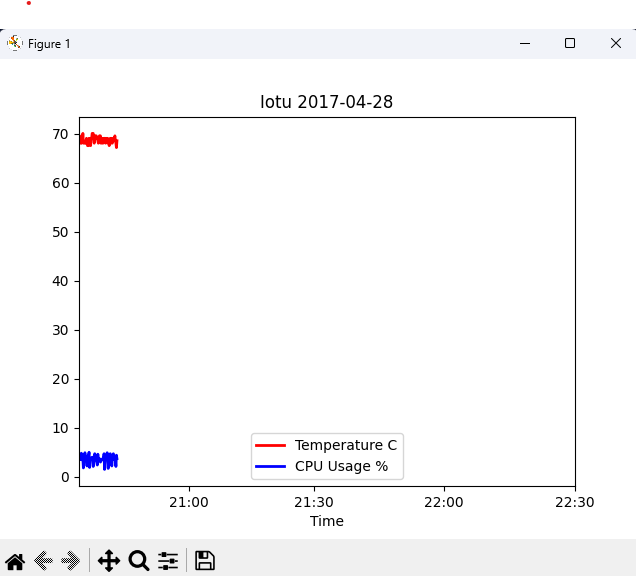
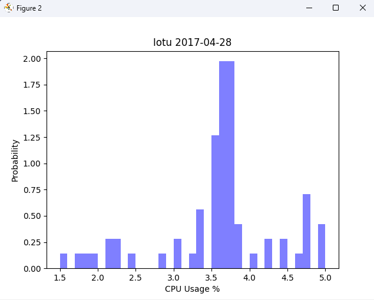
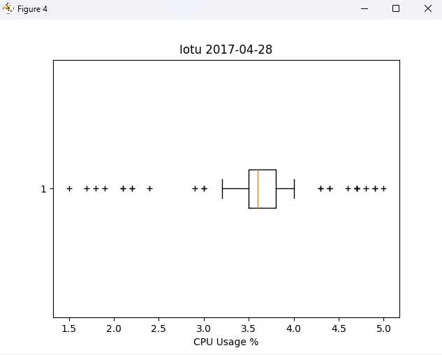
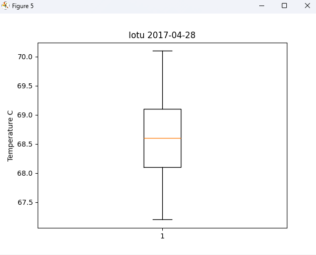
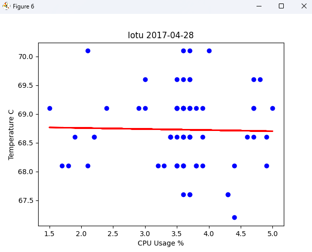
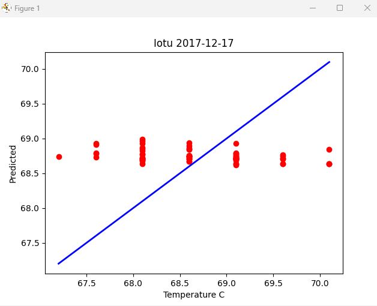

# CPE 322 Lab 8

## Chris Bertuzzi

---

### Setup, Package Installation

1. Install Packages

`pip3 install numpy scipy scikit-learn matplotlib pandas tensorflow keras`

2. Save cpudata as CSV

3. Edit plt_final.py and plt_cv2.py

`data = read_csv('cpudata.csv')`

4. Run Scripts

---

### plt_final.py Outputs

### plt_cv2.py Output

---
