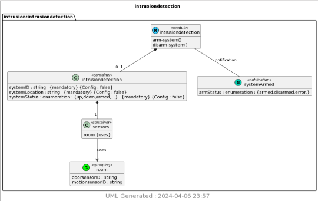

# CPE 322 Lab 9

## Chris Bertuzzi

---

### Setup

1. Install packages

`pip3 install pyang`

`pip3 install plantum1`

2. Generate YIN and UML Files Using pyang

`pyang -f yin -o intrusiondetection.yin intrusiondetection.yang
pyang -f uml -o intrusiondetection.uml intrusiondetection.yang --uml-no=stereotypes,annotation,typedef`

3. Generate PNG Using PlantUML

`python3 -m plantuml intrusiondetection.uml`

4. View image using pinta

`pinta "intrusiondetection.png"`

